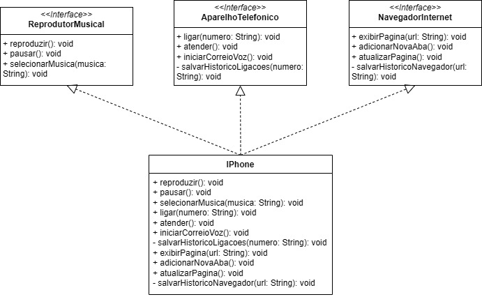

# Modelagem e Diagramação de um Componente iPhone

Diagrama de classes de um iPhone de 2007, com três interfaces que representam o reprodutor de música, telefone e navegador de internet, implementadas na classe principal IPhone. O diagrama está implementado em Java.

## Como Executar

1. Realize o download ou clone do repositório base
2. Entre na pasta src
3. Compile o arquivo Usuario.java pela IDE ou Editor de Texto de sua preferência (recomendo Eclipse ou Visual Studio Code)

## Como Usar

1. Entre na pasta src
2. Abra o arquivo Usuario.java
3. Use os métodos públicos da classe IPhone (veja o diagrama para referência)